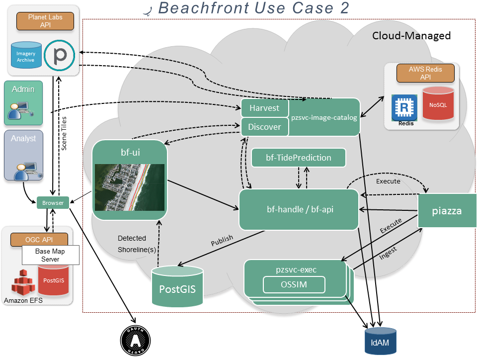

# Shoreline Detection Use Case 2
This is an extension of [Use Case 1](ShorelineDetection1.md).
- This workflow introduces an image catalog that contains metadata about available images
- The analyst provides search criteria and a service returns descriptions of images that match
- Those image descriptors are evaluated for fitness based on metadata including cloud cover, date, etc.
- The analyst chooses images and the process proceeds as before
- The analyst has the ability to review the results

## Data Models
### Detection Algorithms
- ID
- Name
- Description
- Input constraints
- Parameters

### Scene Criteria
- Date of Collection (ISO-8601)
- Maximum Date of Collection (ISO-8601)
- Bounding Box (GeoJSON BBox)
- Percentage of cloud cover (maximum)
- File format
- Bit depth
- Resolution (ground sample distance)
- Bands (string array)
- File size (maximum)

### Detection Parameters
- Algorithm ID
- Algorithm executable command
   - IDs of input file(s) 
   - Output file(s)
   - Additional parameters

### Scene Descriptor
- ID
- URI (path)
- Small Thumbnail URI
- Large Thumbnail URI
- Metadata
  - Based on [Scene Criteria](#scene-criteria)
- Beachfront Evaluation Score (if available)

### Detected Shorelines
GeoJSON Feature Collection
- features
  - geometry
- properties
  - GEOINT_ID (int or string)
  - COLLECTION_PLATFORM (string)
  - DATE_TIME (ISO-8601 string)
  - RESOLUTION (float)
  - CV_ALGORITHM_NAME (string)

### Detection Analysis Results
TBD

### File Bucket Metadata
- algorithm execution details
- date of collection
- sensor name
- image ID

## Concept of Operations
### High Level

[original file](https://www.websequencediagrams.com/#open=133232)

#### Preconditions
These activities are out of scope for this use case, but required for it to be successful.

##### Cloud Deployment
- [x] service reporting the available detection algorithms
- [x] pzsvc-image-catalog
- [ ] bf-api
- [x] detection algorithms
- [x] tide service
- [ ] PostGRES
- [ ] GeoServer

##### Piazza Service Registration
- [x] detection algorithms

##### Metadata Harvesting
- [x] One or more image archives must be established. They may be managed inside or outside Piazza. 
- [x] The image catalog must be populated with metadata about available images from each image archive.

#### Function: Get Available Services
Location of [deployed services](#cloud-deployment) is loaded from the environment.

#### Information Exchange: Discover Algorithms
###### Request - GET /service
- Piazza auth key

###### Response
- Piazza service list

###### Security
The request requires authentication and authorization with Piazza.

#### Function: Authentication
The user is presented with an authentication challenge. 
The user provides credentials via OAUTH2 which are verified by an IdAM component.

#### Function: Discover Scenes - [see below](#discover-scenes)

#### Function: Displayed Discovered Scenes
- [Scene Descriptors](#scene-descriptor)

#### Function: Select Input Parameters
- [Detection Parameters](#detection-parameters)

#### Function: Detect Shorelines - [see below](#detect-shorelines)

#### Function: Review Detected Shorelines - [see below](#review-detected-shorelines)

#### Function: Display Detected Shorelines - [see below](#display-detected-shorelines)

### Asynchronous Action (pattern)
 [original file](https://www.websequencediagrams.com/#open=184352)

This pattern is used throughout and is indicated by a bar around the swim lane.

#### Information Exchange: Request
###### Request
In most cases these asynchronous requests require authentication and authorization. Therefore the requests will be wrapped in a JWT that contains the security assertion for that user.
- JSON Web Token (JWT) 
   - Security Assertion
   - _variable_

###### Response
- Job ID

#### Function: Operation
- update job status
- _variable_

#### Information Exchange: Authenticate
Authentication is through an externally controlled system.
###### Request
- authentication token

###### Response
- confirmation

#### Information Exchange: Authorize
Authorization is through an internally controlled system 
that manages users and roles.
###### Request
- authorization token
- role

###### Response
- confirmation

#### Information Exchange: Log
###### Request
- User ID
- Operation
- Operation status

###### Response: N/A

#### Information Exchange: Get Status
###### Request
- _variable_

###### Response
- status

#### Information Exchange: Get Results
###### Request
- _variable_

###### Response
- _variable_

### Discover Scenes
 [original file](https://www.websequencediagrams.com/#open=142856)

#### Preconditions
- [x] Metadata Harvesting -or-
- [ ] Load Image Provider locations from environment

#### Function: Select Scene Discovery Criteria
- [Scene criteria](#scene-criteria)

#### Information Exchange: Discover Scenes
###### Request (Analyst)
- JWT
  - [scene criteria](#scene-criteria)
  - security assertion
  - Image Provider security token (if needed)

###### Response (JSON)
- [Scene Descriptors](#scene-descriptor)

###### Security
This information exchange requires authentication and authorization. 
Therefore the request must contain a security assertion 
that is validated before the operation proceeds.

#### Information Exchange: Search Images
If there is no image catalog, federate a call to all registered image providers
###### Request
- [scene criteria](#scene-criteria) (vendor-specific format)
- Image Provider security token

###### Response
- [Scene Descriptors](#scene-descriptor) (vendor-specific format)

#### Information Exchange: Get Tides
###### Request
- Descriptor
  - Date/time (YYYY-MM-DD-hh-mm)
  - lat
  - lon

###### Response
- Tide Descriptor
  - Date/time
  - lat
  - lon
  - results
    - 24h Max
    - 24h Min
    - Tide amount

###### Security
The request may require authentication and authorization 
with the owner of the tide prediction service.

#### Function: Retrieve Scenes
- If there is no image catalog, assemble results from the responses from the Image Provider and the Tide Prediction Service 
- If caching is requested
  - Search the repository for matching scenes
  - Put matching scenes in the cache
  - Periodically check the cache. If the cache is complete or sufficiently big, return the required results.
  - Cap the cache size at a modest size to keep the memory footprint in check.
- If caching is not requested (not recommended for large result sets as this might be slow)
  - Search the repository for matching scenes
  - Return the results

### Shoreline Detection Execution

[original file](https://www.websequencediagrams.com/#open=133238)

### Participants
#### Client
This is generally a web client (e.g., bf-ui) although in theory it can be a CLI.

#### Broker
Originally this was bf-handle. It is being migrated to bf-api.
It must know how to compose commands for detection operations.

#### Piazza
In the context of this operation, 
Piazza supports workflow management and provides file storage.

#### pzsvc-exec
This forms a REST-API and wrapper around a CLI-based detection algorithm.
If a Detection Algorithm is deployable as its own REST API, 
then it can be registered and accessed directly 
but the Broker still must be aware of its interface.

#### Detection Algorithm
This performs the actual shoreline detection.
The Broker must be aware of the interface used by the detection algorithm 
so that it can compose an appropriate command based on the inputs.

#### Information Exchange: Detect Shorelines
###### Request (Async)
- JWT
  - [Detection Inputs](#detection-inputs)
  - security assertion
  - Piazza security token
  - Image Provider security token (if needed)

###### Response
- An appropriate error -OR-
- File Identifier for Detected Shorelines

###### Security
This information exchange requires authentication and authorization with Beachfront. 
Therefore the request must contain a security assertion 
that is validated before the operation proceeds.

#### Function: Prepare Executable Call
- Build executable command
- Acquire single-use token that will be used by pzsvc-exec

#### Information Exchange: Execute
###### Request (Broker) (Async)
- JWT
  - [Detection Inputs](#detection-inputs)
  - User ID
  - Single-use token
  - Piazza security token
  - Image Provider security token (if needed)

###### Response
- An appropriate error -OR-
- Process outputs
  - File Identifier for Detected Shorelines

###### Security
The information exchange requires authentication and authorization with Piazza.
Therefore the request must contain a Piazza security token 
in addition to other security items that are required further down the line.

#### Function: Manage Scaling
- Piazza maintains an externally accessible status that it updates based on the behavior of the synchronous connection to pzsvc-exec, and serves the results that come back from the synchronous connection.
- Piazza tracks the instances of pzsvc-exec and how many jobs they're serving, making sure that the jobs are being distributed correctly, and standing up or shutting down instances as necessary to handle the workload.

#### Information Exchange: Execute
###### Request (Piazza)
- JWT
  - [Detection Inputs](#detection-inputs)
  - User ID
  - Single-use token
  - Piazza security token
  - Image Provider security token (if needed)

###### Response
- An appropriate error -OR-
- Process outputs
  - File Identifier for Detected Shorelines

###### Security
This information exchange requires authentication and authorization with Beachfront. 
Therefore the request must contain a single-use token that is validated before the operation starts and is consumed when the operation completes.

#### Function: Validate Inputs
- Validate input parameters
- Validate single-use token

#### Information Exchange: Get File [see below](#get-file)

#### Information Exchange: Execute Algorithm
###### Request (EXECUTE)
- [Detection Inputs](#detection-inputs)

###### Response
- Error message -OR-
- [Detected Shorelines](#detected-shorelines) (GeoJSON)

#### Function: Algorithm Execution

#### Function: Inspect Results (pzsvc-exec)

#### Information Exchange: Store Detected Shorelines [see below](#ingest-file)
- [Detected Shorelines](#detected-shorelines) (GeoJSON)

#### Function: Compose Response

#### Function: Inspect Results (bf-handle)

#### Information Exchange: Update File Metadata [see below](#update-file-metadata)

#### Information Exchange: Metadata Injection [see below](#metadata-injection)

#### Information Exchange: Deploy File [see below](#deploy-file)

#### Function: Cleanup
Cleanup activities like the following may be performed.
- Delete input file
- Delete output file
- Consume single-use token

### Get File
[original file](https://www.websequencediagrams.com/#open=184563)

#### Information Exchange: Get File (from Piazza)
###### Request: GET /file/{dataId}
- Piazza credentials
- File ID

###### Response
- File

###### Security
The request requires authentication and authorization with Piazza

#### Function: Retrieve file from storage (Piazza)
Out of scope

#### Information Exchange: Get File (Trusted or Untrusted File Service)
###### Request (Client or Ingester)
- Vendor-specific credentials
- URL
   - File ID

###### Response
- File

###### Security
In most cases the request requires authentication and authorization 
with the file provider (e.g., Planet Labs)

#### Function: Retrieve file from storage (File Service)
Out of scope

#### Information Exchange: Get File (Untrusted Service via Ingester)
###### Request (Async)
- Vendor-specific credentials
- File ID

###### Response
- File

###### Security
In most cases the request requires authentication and authorization 
with the file provider. It may separately require A/A with the ingester
(AKA dirty bucket/clean bucket).

#### Function: Sanitize File
Out of scope

### Ingest File
 [original file](https://www.websequencediagrams.com/#open=141890)

#### Information Exchange: Ingest File 
###### Request
* File (POST) -OR-
* File URL
* Piazza credentials

###### Response (Async)
- Job Status
- If Complete
  - Location of Ingested File

###### Security
The request requires authentication and authorization 
with the owner of the file bucket (e.g., Piazza).

#### Information Exchange: Store File 
###### Request
* File (POST) -OR-
* File URL

###### Response N/A

### Update File Metadata
[original file](https://www.websequencediagrams.com/#open=184556)

#### Information Exchange: Update Metadata
###### Request
* File (PUT)
* Security token

###### Response N/A

###### Security
The request requires authentication and authorization 
with the owner of the file bucket (e.g., Piazza).

### Metadata Injection
[original file](https://www.websequencediagrams.com/#open=177674)

#### Information Exchange: Get File [see above](#get-file)
The file is the [Detected Shorelines](#detected-shorelines) GeoJSON.

#### Function: Collect Centroid
We need to pick a single point for each scene. 
Large scenes will have lower tide accuracy as you move away from the centroid.

#### Information Exchange: Get Tide
###### Request
- Date/time (YYYY-MM-DD-hh-mm)
- lat
- lon

###### Response
- Date/time
- lat
- lon
- results
  - 24h Max
  - 24h Min
  - Tide amount

###### Security
The request may require authentication and authorization 
with the owner of the tide prediction service.

#### Function: Update Metadata
Each feature has its metadata updated based on tide information
and whatever else is already on hand.

#### Information Exchange: Ingest File [see above](#ingest-file)
Re-ingest the file and get a new file ID.

### Display Detected Shorelines
 [original file](https://www.websequencediagrams.com/#open=143835)

#### Information Exchange: Get Map
###### Request
- GetMap request

###### Response
- Map image

#### Function: Display Map

#### Information Exchange: Get File [see above](#get-file)
The requested file is the Detected Shorelines

#### Function: Review Detected Shorelines [see below](#review-detected-shorelines)

### Detection Review

[original file](https://www.websequencediagrams.com/#open=140039)

*Note: This has not been implemented yet.*

#### Information Exchange: Review Detection
###### Request
- Detection Review Parameters
  - Location of detected shorelines
  - Bounding box of detected shorelines
- Continuation Options
  - Select baseline shorelines from feature repository
  - Store baseline shorelines in key/value store
  - Call bf-analyze with detected shorelines, detected shorelines

###### Response
- Job Status
- If complete
  - [Detection Analysis Results](#detection-analysis-results)

#### Information Exchange: Get Baseline Features
###### Request
- Get Feature request
  - Feature type
  - Bounding box

###### Response
- Features (GeoJSON)

#### Function: Perform Analysis
1. Qualitative analysis
1. Quantitative analysis
1. Write output file

#### Information Exchange: Publish Analysis Results
###### Request
- [Detection Analysis Results](#detection-analysis-results)

###### Response - N/A

